# DEV1004 Assessment 3: Develop a CI/CD Pipeline

## The Century Screening Room - Continuous Integration and Deployment

### Overview

This project demonstrates the development of setting up a CI/CD pipeline for the Century Screening Room MERN app.
The CI/CD pipeline automates testing and deployment using GitHub Actions, Docker and Render with the frontend being served on Netlify separately.

This document includes explanations for:
- The purpose and functionality of the automation workflows, including diagrams that show how each phase connects and interacts.
- The tools and systems used in this pipeline, what they do in this project, and why they were chosen over alternative options.
- The services and technologies used by the application, and how they are managed through continuous integration and continuous delivery.

---

## Pipeline Overview

This CI/CD pipeline:

- Uses multiple triggers (`pull_request`, `push`, `workflow_run`)
- Automates linting and tests
- Stores persistent artifacts
- Uses reusable workflows (no custom actions)
- Builds and versions Docker images
- Deploys automatically via webhook
- Verifies deployment health

The workflows execute successfully and deploy the backend container to Render using Docker Hub as the image registry.

**The pipeline works in 3 main stages including:**

**1. Pull Request Validation**
- When a pull request is opened or updated:
- ESLint runs on backend and frontend code.
- Backend tests (Jest) run inside Docker.
- Frontend tests (Vitest) run inside Docker.
- If any job fails, the pull request cannot be merged.
- If all jobs pass, the pull request is ready to be merged.

This acts as a quality gate to prevent broken code from reaching the main branch.

**2. Merge to main**
- When code is pushed to the main branch:
- Backend tests run again as an additional safety check.
- A production Docker image is built for the backend, preparing it for deployment to Render.
- The image is pushed to Docker Hub with two tags:
    - latest
    - main-<sha> (linked to a specific commit)

This ensures that only tested code is packaged for deployment.

**3. Deployment to Render**
- After the image is successfully built and pushed:
    - The workflow triggers Render using a Deploy Hook URL.
    - Render pulls the latest image from Docker Hub.
    - The pipeline checks the /health endpoint to confirm the deployment succeeded.
    - If the health check fails, the workflow fails.

This final step ensures that the backend is live and responding correctly after deployment.

---

## CI/CD Tools & Systems

These are the main tools and systems I chose including a description of what they do, what it's used for and why I chose them over alternative options.

### 1. GitHub Actions

**What it does:**
- GitHub Actions is a CI/CD platform which runs workflow YAML files automatically when certain events occur in the repository (such as pull requests or pushes).

**What it's used for in this project:**
- Run tests for backend (Jest) and frontend (Vitest) inside Docker to check code and catch bugs early and acts as a validation check to ensure that tests passes successfully before merging to main.
- Runs ESLint on backend and frontend
- Re-runs backend tests on merge to main
- Builds and pushes a Docker image
- Triggers backend deployment to Render
- Stores test logs as artifacts (retained for 30 days)

**Why I chose it over alternatives:**

I chose GitHub Actions because:
- It integrates directly with GitHub (no extra setup required making it more easier and seamless to use).
- It is free for public repositories (which is beneficial for a student project to avoid incurring costs).
- It supports reusable workflows which helps keep the YAML files DRY.

**Compared to alternatives:**
- **Jenkins** requires self-hosting and server configuration. For a student project, this adds unnecessary infrastructure complexity which I wanted to avoid to keep it simplified for this project scope.
- **CircleCI** provides cloud CI/CD but has paid usage limits and pricing tiers that are not necessary at this scale.

For this project, GitHub Actions was the simplest and most appropriate tool to use and was also the most familiar tool to work with given my current experience level.

---

### 2. Docker and Docker Compose

**What it does:**
- Docker packages applications into containers so they run the same way across environments.
- Docker Compose manages multi-container setups which is used in this case for setting up the backend, frontend and database (for development and testing).

**What it's used for in this project:**
- It's used in `test_backend.yml` to run isolated tests (in a Docker container to control environment tests).
- Runs backend and frontend tests using `docker-compose.test.yml`.
- Backend tests use `mongodb-memory-server` (no external database required in CI).
- It's used in `build_push.yml` to build and push the production image from `backend/Dockerfile` (multi-stage build) to Docker Hub, preparing it for the next step for backend to be deployed to Render.

**Why I chose it over alternatives:**
I chose to use Docker because:
- It is a highly industry standard tool used for containerisation, enabling tests and deployments to be more consistent across different environments.
- Keeps CI testing environment consistent with production image.
- Avoids "works on my machine" issues.
- It is free and more simpler to use than compared to the alternative options below.

In comparison to the alternative options, such as:
- Kubernetes: In this case, I considered Kubernetes to be more complex and not required for a single backend deployment for this project.

---

### 3. Docker Hub (Image repository)

**What it does:**
- Docker Hub stores built Docker container images in a cloud registry, keeping a revision history of Docker built images including image tags to help identify different builds.

**What it's used for in this project:**
- Docker Repository: `lulucodes/century-screening-room-backend`.
- On merge to `main`, the pipeline pushes include version image tags including:
    - `latest` (is used by Render).
    - `main-<sha>` (provides commit traceability).

**Why I chose it over alternatives:**
- Free for public repositories.
- Integrates seamlessly with GitHub Actions.
- Simpler setup compared to AWS ECR.

---

### 4. Render (Cloud Platform)

**What it does:**
- Render hosts Docker-based web services and automatically redeploys on trigger.
- Render is the cloud host used for backend deployment.

**What it's used for in this project:**
- In `cd_production.yml`, it triggers deployment via a webhook to deploy the latest tag image from Docker Hub and runs the backend as a web service. Then deployment is confirmed using a /health endpoint to check and that it's live.
- It also handles scaling and connects to services like a database via environment variables setup.

**Why I chose it over alternatives:**
- Render has a free tier suitable for the current scope of this project.
- It provides seamless Docker support and auto-deploys.
- Free tier suitable for student projects.
- Supports direct Docker image deployment.
- It requires less setup than AWS or Google Cloud.

In comparison to other Cloud Hosting Platforms such as:
- Google Cloud Run and AWS ECS: Requires more complex configurations and billing setup and can incur costs especially if not managed properly.
- Heroku:
- Railway:

---

### 5. MongoDB Atlas

**What it does:**

- MongoDB Atlas is a Cloud-hosted MongoDB database.

**What it's used for in this project:**

- Used in production only
- Backend connects via `DATABASE_URI`
- CI tests use `mongodb-memory-server` instead

**Why I chose it over alternatives:**
- To keep the same and familiar cloud hosting platform used in project.
- Free and beginner friendly UI to use and easy setup and most suitable cloud database used throughout project.

---

## Workflow Purpose and Functionality

### Phase 1: PR Tests and Validation Checks (`ci_pr.yml`)

**Purpose:** Ensures code is tested and passes successfully before merge

**What it does:**
- Run ESLint (fails on warnings)
- Runs backend tests in Docker container (using Jest)
- Runs frontend tests in Docker container (using Vitest)
- The PR quality validation checks block merge if either of the tests fail
- Uploads test logs as artifacts

**Reusable workflows called:**
- `test_backend.yml`
- `test_frontend.yml`
- (These workflow tests can also be run independently on workflow_displatch)

**Triggers:**
- `pull_request` (branch: main)
- `workflow_dispatch` (allows for manual trigger)

---

### Phase 2: CI Main (Build) Pipeline (`ci_main.yml`)

**Purpose:** Build and publish production Docker image after merge to main

**What it does:**
- Re-runs backend tests
- Builds production image from backend/Dockerfile (target: production)
- Pushes to Docker Hub with tags: :latest and :main-<sha>
- Writes a pipeline summary with commit and image tag

**Reusable workflows called:**
- `build_push.yml`

**Trigger:**
- `push` to main

---

### Phase 3: Deployment - CD Production Pipeline (`cd_production.yml`)

**Purpose:** Deploy backend to Render after successful build

**What it does:**
- Triggers only when CI Main Pipeline succeeds (using workflow_run + if successful condition)
- Sends POST request to Render deploy hook
- Polls `BACKEND_URL/health` and retries up to 10 times
- Fails workflow if no 200 response.

**Trigger:**
- `workflow_run` after CI Main completes successfully

---

## Secrets and Configuration

Secrets are not hardcoded in workflow files. They are injected securely through GitHub Actions Settings (under Secrets and variables).

**Secrets Used:**
- `DATABASE_URI`
- `DOCKERHUB_USERNAME`
- `DOCKERHUB_TOKEN`
- `JWT_SECRET_KEY`
- `OMDB_API_KEY`
- `RENDER_DEPLOY_HOOK_URL`

**Repository Variables:**
- `BACKEND_URL`
- `VITE_API_URL`

---

## Relations and Dependencies

**Service flow:**

Developer → GitHub Repo → GitHub Actions → Docker → Docker Hub → Render → MongoDB Atlas

Key dependencies:

- GitHub Actions requires Docker Hub credentials.
- Render requires Docker Hub image.
- Backend requires `DATABASE_URI` (Atlas).
- Deployment success confirmed via health check.
- (Backend tests depend only on in-memory MongoDB during CI).

---

## Screenshots

### CI PR Tests & Validation Checks
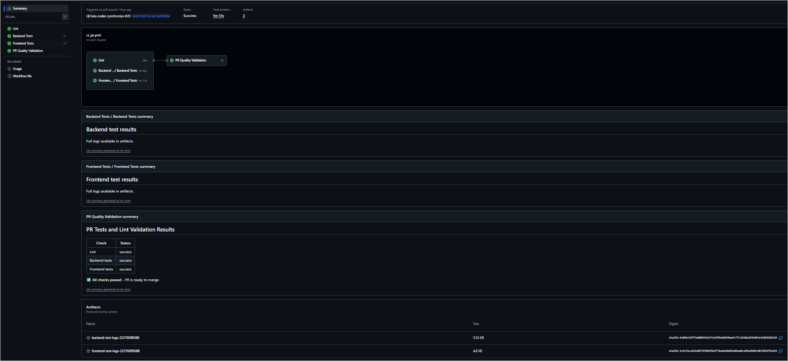

### CI Main Pipeline
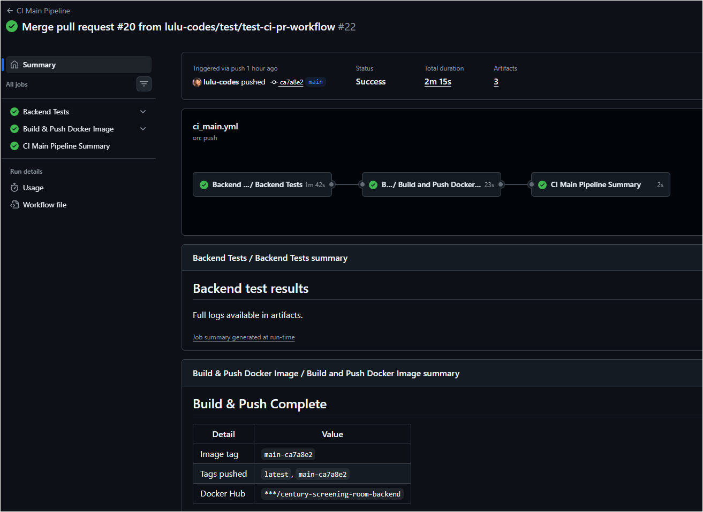

### CI Main Pipeline Summary
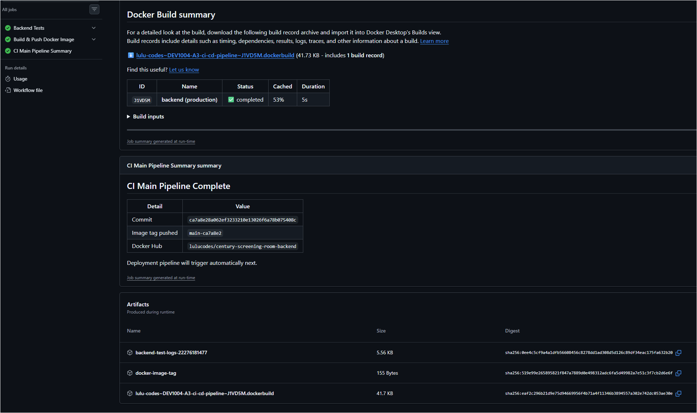

### Build & Push Workflow
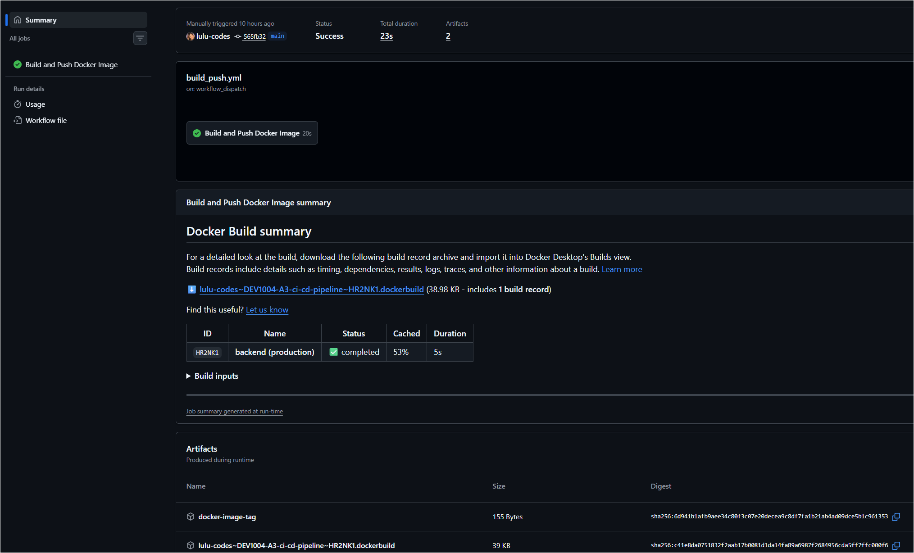

### CD Production Pipeline
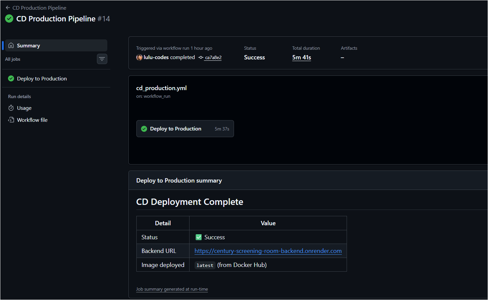

### Backend Tests
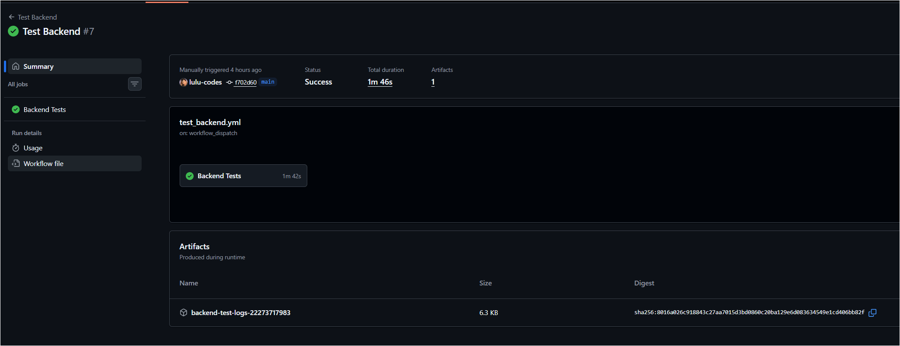

### Frontend Tests
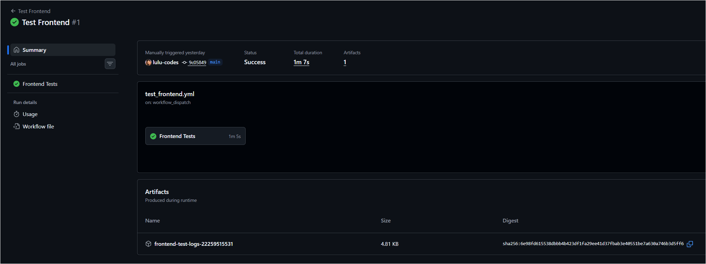

### Docker Hub Images
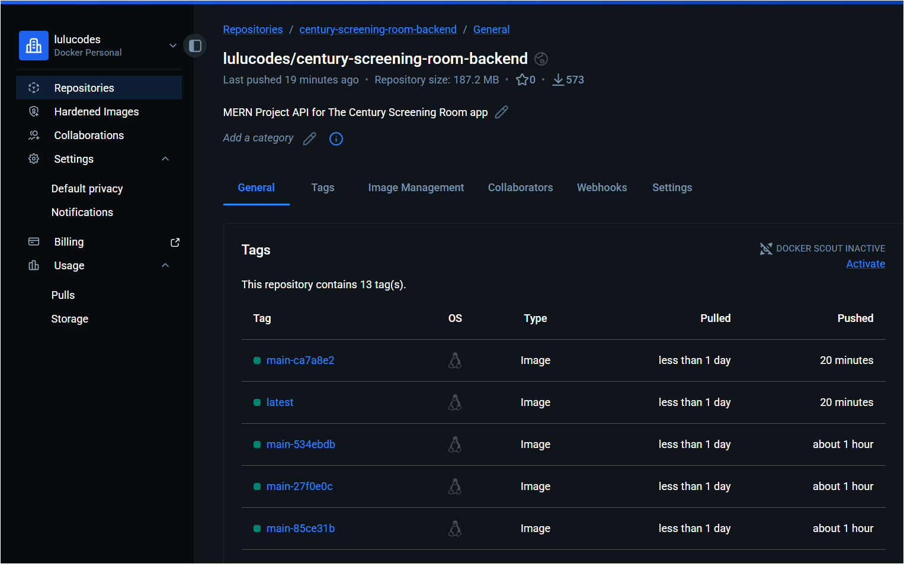

### Netlify Deployment
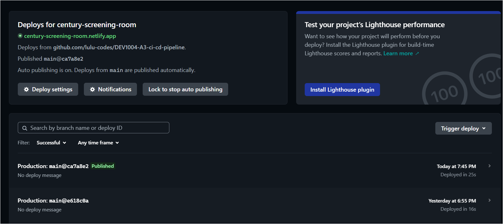

### Render Environment Variables
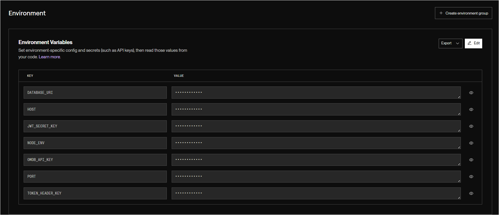

### Render Deployment
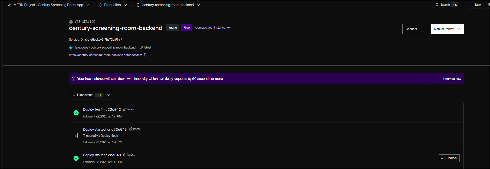