# DEV1004 Assessment 3: CI/CD Pipeline

## The Century Screening Room - Continuous Integration and Deployment

### Project Overview

This project demonstrates the development of setting up a CI/CD pipeline for the Century Screening Room MERN app.
The CI/CD pipeline automates testing and deployment using GitHub Actions, Docker and Render with the frontend being served on Netlify separately.

This document includes explanations for:

- The purpose and functionality of the automation workflows, including diagrams that show how each phase connects and interacts.
- The tools and systems used in this pipeline, what they do in this project, and why they were chosen over alternative options.
- The services and technologies used by the application, and how they are managed through continuous integration and continuous delivery.

**Key Features:**

- Automated testing and linting on pull requests
- Docker based containerization for consistency
- Multi-stage deployment with health checks
- Separate frontend (Netlify) and backend (Render) deployments
- Image versioning and rollback capability

---

## Pipeline Architecture

This CI/CD pipeline implements automated quality control through **3 main phases**, each triggered by specific GitHub Actions events:

| Phase             | Trigger                               | Purpose                    | Key Activities                            |
| ----------------- | ------------------------------------- | -------------------------- | ----------------------------------------- |
| **1. Validation** | `pull_request`                        | Test and lint before merge | ESLint, Jest tests, Vitest tests          |
| **2. Build**      | `push` to main                        | Package approved code      | Re-test, build Docker image, tag and push |
| **3. Deployment** | `workflow_run` (after build succeeds) | Deploy to production       | Trigger Render, pull image, health check  |

**This separation prevents:**

- Untested code being built
- Failed builds being deployed
- Manual deployment errors

### Workflow Functionality

- Automated linting and testing
- Reusable workflows (DRY principles)
- Docker-based environment consistency
- Versioned image tagging for rollback
- Health check verification post-deployment
- Artifact retention (logs stored for 30 days)

---

## Pipeline Flow Diagram

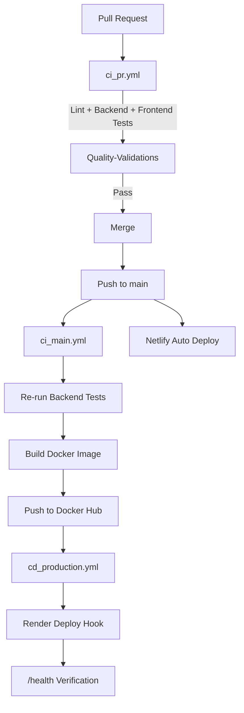
```mermaid
flowchart TB
    PR[Pull Request] --> CI-PR[ci_pr.yml]
    CI-PR -->|Lint + Backend + Frontend Tests| Quality-Validations
    Quality-Validations -->|Pass| Merge

    Merge --> MainPush[Push to main]
    MainPush --> CIMain[ci_main.yml]

    CIMain --> TestAgain[Re-run Backend Tests]
    TestAgain --> Build[Build Docker Image]
    Build --> PushHub[Push to Docker Hub]

    PushHub --> CD[cd_production.yml]
    CD --> RenderDeploy[Render Deploy Hook]
    RenderDeploy --> HealthCheck[ /health Verification]

    MainPush --> Netlify[Netlify Auto Deploy]
```

---

## Pipeline Workflows

**The pipeline works in 3 main stages including:**

### 1. Pull Request Validation (CI before merge)

This stage acts as a quality control gate.

When a pull request is opened:

1. GitHub Actions triggers `ci_pr.yml`

2. The workflow:
   - Runs ESLint on both backend and frontend
   - Runs backend tests (Jest) inside Docker
   - Runs frontend tests (Vitest) inside Docker
3. Each test job must succeed
4. A validation job determines whether all required checks passed
5. If any job fails, the pull request cannot be merged. Otherwise, if all jobs pass, the pull request is ready to be merged.

Using Docker for tests ensures:

- Consistent Node environment
- Controlled dependency versions
- No dependency on the developer’s local machine

This acts as a quality gate to prevent broken code from reaching the main branch to reduce risk of deployment to production.

---

### 2. Merge to main (CI - Build stage)

This stage ensures production packaging only occurs after approval.

When code is merged:

1. A `push` event triggers `ci_main.yml`.
2. Backend tests run again (re-running backend tests here provides a safety layer incase minor workflow changes affect runtime and environments variables differ).
3. Docker builds a multi-stage production image (ensures that tested code is packaged for deployment)
4. The image is tagged both with:
   - `latest` (Stable deployment target)
   - `main-<sha>` (linked to a specific commit and provides traceable version history)
5. The image is pushed to Docker (with tags for revision history)

---

### 3. Deployment to Render (CD - Production Phase)

Deployment is handled in the `cd_production.yml` and triggered using `workflow_run` which means:

- It only runs after the CI Main Pipeline completes (after the image is successfully built and pushed) and if checks result in `success`.
- This final step ensures that the backend is live and responding correctly after deployment.

**The workflow includes:**

1. Sends a `POST` request to Render's deploy hook URL.
2. Render then pulls the `latest` tag from Docker Hub
3. The container is then deployed via Render
4. GitHub Actions polls `/health` to perform a health check on endpoint to confirm the deployment succeeded and to prevent silent deployment failures.
5. If the health check fails, the workflow fails.

---

### CI/CD Detailed Pipeline Flow Diagram

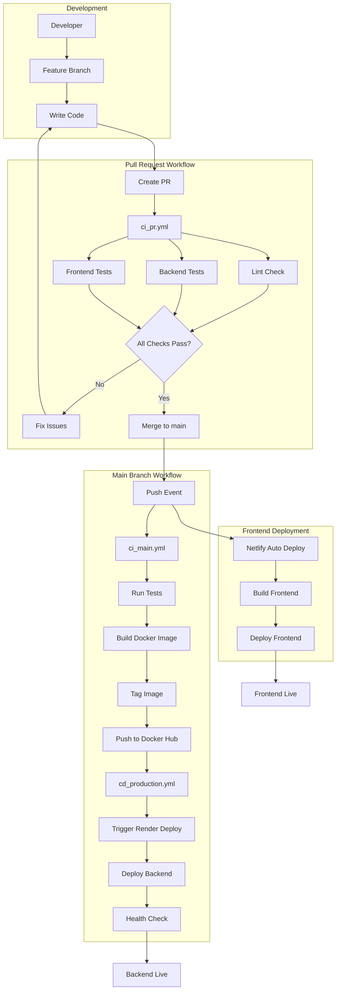
```mermaid
flowchart TB
    subgraph Development
        DEV[Developer] --> BRANCH[Feature Branch]
        BRANCH --> CODE[Write Code]
    end

    subgraph PullRequest [Pull Request Workflow]
        CODE --> PR[Create PR]
        PR --> CIPR[ci_pr.yml]

        CIPR --> LINT[Lint Check]
        CIPR --> BTEST[Backend Tests]
        CIPR --> FTEST[Frontend Tests]

        LINT --> GATE{All Checks Pass?}
        BTEST --> GATE
        FTEST --> GATE

        GATE -->|No| FIX[Fix Issues]
        FIX --> CODE
        GATE -->|Yes| MERGE[Merge to main]
    end

    subgraph MainBranch [Main Branch Workflow]
        MERGE --> PUSH[Push Event]
        PUSH --> CIMAIN[ci_main.yml]

        CIMAIN --> RETEST[Run Tests]
        RETEST --> BUILD[Build Docker Image]
        BUILD --> TAG[Tag Image]
        TAG --> PUSH_HUB[Push to Docker Hub]

        PUSH_HUB --> CD[cd_production.yml]
        CD --> WEBHOOK[Trigger Render Deploy]
        WEBHOOK --> DEPLOY[Deploy Backend]
        DEPLOY --> HEALTH[Health Check]
    end

    subgraph FrontendDeploy [Frontend Deployment]
        PUSH --> NETLIFY[Netlify Auto Deploy]
        NETLIFY --> BUILD_FE[Build Frontend]
        BUILD_FE --> DEPLOY_FE[Deploy Frontend]
    end

    HEALTH --> LIVE_BE[Backend Live]
    DEPLOY_FE --> LIVE_FE[Frontend Live]
```

---

## CI/CD Tools & Systems

**Technologies Used:**

These are the main tools and systems I chose including a description of what they do, what it's used for and why I chose them over alternative options.

- **CI/CD:** GitHub Actions
- **Containerisation:** Docker & Docker Compose
- **Registry:** Docker Hub
- **Backend Hosting:** Render
- **Frontend Hosting:** Netlify
- **Database:** MongoDB Atlas

### 1. GitHub Actions

**What it does:**

- GitHub Actions is a CI/CD platform which runs workflow YAML files automatically when certain events occur in the repository (such as pull requests or pushes).
- GitHub Actions is responsible for orchestrating the entire CI/CD lifecycle of this project.

It provides:

- Event-driven workflow automation
- Job dependency management
- Secure secret injection
- Artifact storage
- Conditional execution logic

**What it's used for in this project:**

- Multiple workflows for separation of responsibility
- Reusable workflows (`test_backend.yml`, `test_frontend.yml`, `build_push.yml`)
- Conditional workflow triggering (`workflow_run`)
- The reusable workflows allow testing logic to be centralised and avoids duplication between the `ci_pr.yml` and `ci_main.yml` files, makes the CI tests more modular and follows DRY principles.
- Artifact persistence for log retention

**Workflow usage includes:**

- Run tests for backend (Jest) and frontend (Vitest) inside Docker to check code and catch bugs early and acts as a validation check to ensure that tests passes successfully before merging to main.
- Runs ESLint on backend and frontend
- Re-runs backend tests on merge to main
- Builds and pushes a Docker image
- Triggers backend deployment to Render
- Stores test logs as artifacts (retained for 30 days)

**Why I chose it over alternatives:**

I chose GitHub Actions because:

- It integrates directly with GitHub (no extra setup required making it more easier and seamless to use).
- It is free for public repositories (which is beneficial for a student project to avoid incurring costs).
- It supports reusable workflows which helps keep the YAML files DRY.
- Built in runner management so.
- No additional infrastructure requirements.

**Compared to alternatives:**

- **Jenkins** requires self-hosting and server configuration. For a student project, this adds unnecessary infrastructure complexity which I wanted to avoid to keep it simplified for this project scope.
- **CircleCI** provides cloud CI/CD but has paid usage limits and pricing tiers that are not necessary at this scale.

For this project, GitHub Actions was the simplest and most suitable tool to use as:

- It doesn't require the need to connect to external CI tools.
- Keeps all the configurations and secret keys in the repository (stored securely).
- Most familiar tool to work with given my current experience level.

---

### 2. Docker and Docker Compose

**What it does:**

- Docker packages applications into containers to ensure environment consistency across:
  - Local development.
  - CI testing.
  - Production deployment.

**What it's used for in this project:**

Docker Compose manages multi-container setups which is used in this case for setting up the backend, frontend and database (for development and testing).

Docker Implementation

- Backend uses a multi-stage Dockerfile:
  - Builder stage installs full dependencies
  - Production stage installs production-only dependencies

**Docker is used in:**

- CI testing (`docker-compose.test.yml`)
- Production image build (`build_push.yml`)
- Runtime execution (Render)

**In CI:**

- Tests run in controlled container environment.
- Node version is consistent.
- No dependency on host machine.
- Ensures parity with production build stage.

Multi-stage build in Dockerfile includes stages to support better layer caching and is annotated in [Backend Dockerfile](/backend/Dockerfile).

[Docker Compose](docker-compose.yml) and [Docker Compose Test](/docker-compose.test.yml) allows:

- Running backend + frontend containers together during testing.
- Passing environment variables cleanly.
- Isolating test services.

Without Docker, CI would depend on:

- Runner environment differences.
- Possible version mismatches.
- Undetected environment-specific failures.

**Workflow usage includes:**

- It's used in `test_backend.yml` to run isolated tests (in a Docker container to control environment tests).
- Runs backend and frontend tests using `docker-compose.test.yml`.
- Backend tests use `mongodb-memory-server` (no external database required in CI).
- It's used in `build_push.yml` to build and push the production image from `backend/Dockerfile` (multi-stage build) to Docker Hub, preparing it for the next step for backend to be deployed to Render.

**Why I chose it over alternatives:**
I chose to use Docker because:

- It is a highly industry standard tool used for containerisation, enabling tests and deployments to be more consistent across different environments.
- Keeps CI testing environment consistent with production image.
- Avoids "works on my machine" issues.
- It is free and more simpler to use than compared to the alternative options below.

In comparison to the alternative options, such as:

**Kubernetes:**
Kubernetes is a container orchestration platform designed for:

- Distributed microservice environments.
- Auto-scaling clusters.
- Service mesh architecture.

For this project, there is only a single backend service and no container orchestration required for the current scale of this project.
In this case, I considered that Kubernetes would add unnecessary complexity relative to project scale.

---

### 3. Docker Hub (Image repository)

**What it does:**

- Docker Hub stores built Docker container images in a cloud registry, keeping a revision history of Docker built images including image tags to help identify different builds.
- Docker Hub in this project serves as the container registry that connects continuous integration to continuous delivery.

**What it's used for in this project:**

Docker Repository: `lulucodes/century-screening-room-backend`.

Docker Hub is used to:

- Store versioned images.
- Act as the connector between GitHub Actions and Render.
- Provide immutable build artifacts.
- On merge to `main`, the pipeline pushes include tagging strategy of version image tags including:
  - `latest` (deployment target used by Render).
  - `main-<sha>` (provides immutable commit traceability).
  - This supports:
    - Rollback (by manually deploying earlier tag).
    - Version tracing.
    - Audit trail history.

**Why I chose it over alternatives:**

- Highly industry standard tool.
- Free for public repositories.
- Integrates seamlessly with GitHub Actions.
- Simpler setup compared to AWS ECR.

---

### 4. Render (Cloud Platform)

**What it does:**

- Render is the cloud host used for backend deployment.
- Render hosts Docker-based web services and automatically redeploys on trigger.

It provides:

- Container hosting
- Automatic image pull
- Runtime environment variable injection
- Deployment logs
- Health monitoring

**What it's used for in this project:**

- In this project Render does not build the image or run tests, instead it only runs the pre-built container images.
- In `cd_production.yml`, it triggers deployment via a webhook to deploy the latest tag image from Docker Hub and runs the backend as a web service.
- This ensures the responsibilities for CI (validation and build) and for CD (deployment and runtime execution) are kept separate.
- It also handles scaling and connects to services like a database via environment variables setup.
  - The health check verification adds:
    - Deployment confirmation
    - Error surface reduction
    - Fail fast response
- It also handles scaling and connects to services like a database via environment variables setup.

**Why I chose it over alternatives:**

- Render has a free tier suitable for the current scope of this project.
- It provides seamless Docker support and auto-deploys.
- Free tier suitable for student projects.
- Supports direct Docker image deployment.
- It requires less setup than AWS or Google Cloud.

In comparison to other Cloud Hosting Platforms such as:

- Google Cloud Run and AWS ECS: Requires more complex configurations and billing setup and can incur costs especially if not managed properly.
- Heroku:
- Railway:

---

### 5. MongoDB Atlas

**What it does:**

- MongoDB Atlas is a Cloud-hosted MongoDB database and provides cloud storage, managed mongoDB cluster, production database persistence and secure access via connection string (`DATABASE_URI`).

**What it's used for in this project:**

- MongoDB Atlas is used in the production database only.
- Backend connects via `DATABASE_URI`.
- CI tests use `mongodb-memory-server` instead (so no connection to external database for faster execution and prevents accidental data mutation during tets).

**Why I chose it over alternatives:**

- To keep the same and familiar cloud hosting platform used in project.
- Free and beginner friendly UI to use and easy setup and most suitable cloud database used throughout project.

---

### 6. Netlify

**What it does:**

- Netlify is a frontend hosting platform that builds static frontend assets to host globally.
- It automatically deploys on frontend repository updates.

**What it's used for in this project:**

- Netlify hosts the Vite app frontend.
- It automatically builds the frontend when the main branch updates.
- Connects to backend via `VITE_API_URL`.

**Why I chose it over alternatives:**

- Free tier available and suitable for scale of current project.
- Designed for frontend focused deployments.
- Easy integration with GitHub repository.
- Automatically builds frontend.
- Netlify fits directly into this MERN architecture without extra backend configuration.

Compared to alternatives:

- **Vercel** provides similar functionality however as Netlify was used to deploy frontend during project and was familiar to use, I stuck with this option.
- **Firebase Hosting** required additional CLI setup

---

## Service Architecture Diagram

This pipeline implements a layered CI/CD architecture and each layer depends on the previous layer’s success.
There is no direct deployment from developer machine to production.

- Developer Layer = Code creation
- Repository Layer = GitHub event triggers
- CI Layer = Validation & Build
- Registry Layer = Image storage
- CD Layer = Deployment
- Production Layer = Runtime execution

All deployments must pass through:
Code → CI validation → Image build → Registry → Webhook → Deployment → Health verification

This enforces structured release management.

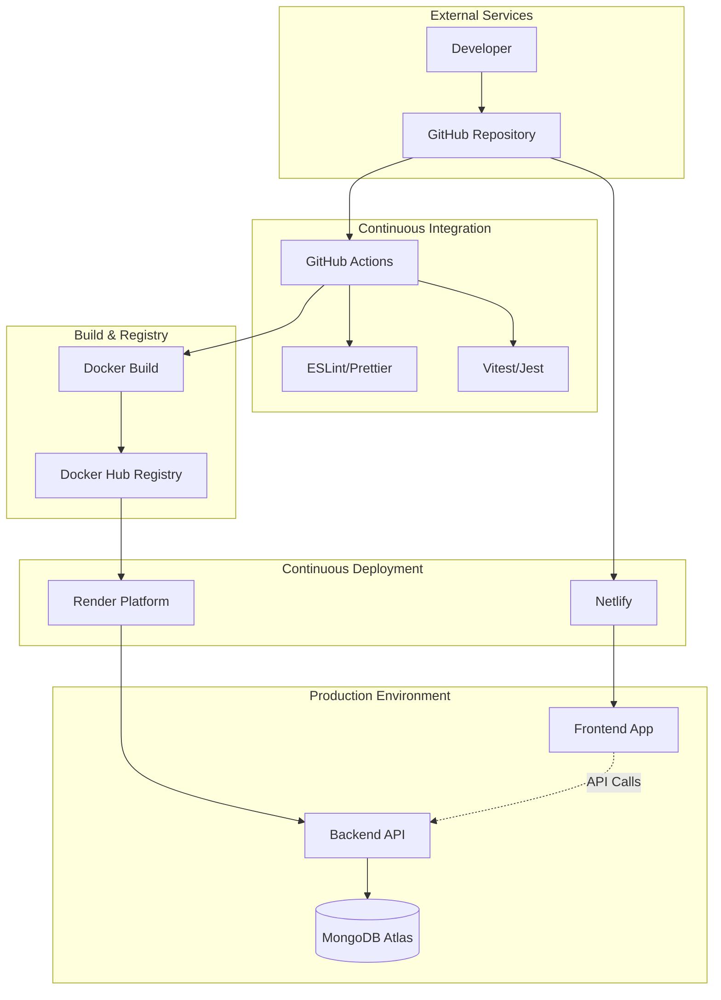
```mermaid
flowchart TB
    subgraph External [External Services]
        DEV[Developer] --> GH[GitHub Repository]
    end

    subgraph CI [Continuous Integration]
        GH --> GHA[GitHub Actions]
        GHA --> LINT[ESLint/Prettier]
        GHA --> TEST[Vitest/Jest]
    end

    subgraph Build [Build & Registry]
        GHA --> DOCKER[Docker Build]
        DOCKER --> HUB[Docker Hub Registry]
    end

    subgraph CD [Continuous Deployment]
        HUB --> RENDER[Render Platform]
        GH --> NETLIFY[Netlify]
    end

    subgraph Production [Production Environment]
        RENDER --> BE[Backend API]
        NETLIFY --> FE[Frontend App]
        BE --> DB[(MongoDB Atlas)]
        FE -.API Calls.-> BE
    end

    style Production fill:#00000
    style Build fill:#00000
    style CI fill:#00000
```

This pipeline is:

- Event-driven
- Modular
- Traceable
- Safe from untested deployments
- Scalable for future expansion

It separates:

- Code validation
- Artifact creation
- Runtime deployment
- Cloud infrastructure

The design ensures:

- Reduced human error
- Automated test enforcement
- Deployment reliability
- Clear visibility of failures

---

## Workflow Purpose and Functionality

### Phase 1: PR Tests and Validation Checks (`ci_pr.yml`)

**Purpose:** Ensures code is tested and passes successfully before merge

**What it does:**

- Run ESLint (fails on warnings)
- Runs backend tests in Docker container (using Jest)
- Runs frontend tests in Docker container (using Vitest)
- The PR quality validation checks block merge if either of the tests fail
- Uploads test logs as artifacts

**Reusable workflows called:**

- `test_backend.yml`
- `test_frontend.yml`
- (These workflow tests can also be run independently on workflow_displatch)

**Triggers:**

- `pull_request` (branch: main)
- `workflow_dispatch` (allows for manual trigger)

---

### Phase 2: CI Main (Build) Pipeline (`ci_main.yml`)

**Purpose:** Build and publish production Docker image after merge to main

**What it does:**

- Re-runs backend tests
- Builds production image from backend/Dockerfile (target: production)
- Pushes to Docker Hub with tags: :latest and :main-<sha>
- Writes a pipeline summary with commit and image tag

**Reusable workflows called:**

- `build_push.yml`

**Trigger:**

- `push` to main

---

### Phase 3: Deployment - CD Production Pipeline (`cd_production.yml`)

**Purpose:** Deploy backend to Render after successful build

**What it does:**

- Triggers only when CI Main Pipeline succeeds (using workflow_run + if successful condition)
- Sends POST request to Render deploy hook
- Polls `BACKEND_URL/health` and retries up to 10 times
- Fails workflow if no 200 response.

**Trigger:**

- `workflow_run` after CI Main completes successfully

---

## How the Tools Connect and Work Together

The pipeline flows like this:

- **On PR:** `ci_pr.yml` calls `test_backend.yml` and `test_frontend.yml` - tests must pass to merge.
- **On merge to main:** `ci_main.yml` re-tests backend, builds and pushes Docker image via `build_push.yml`.
- **After success:** `cd_production.yml` triggers deployment to Render and verifies with health check endpoint that it's live.
- **Services:** Env vars (eg JWT_SECRET_KEY from GitHub secrets) configure auth and database connections during tests and deployment.

## Deployment Flow Diagram

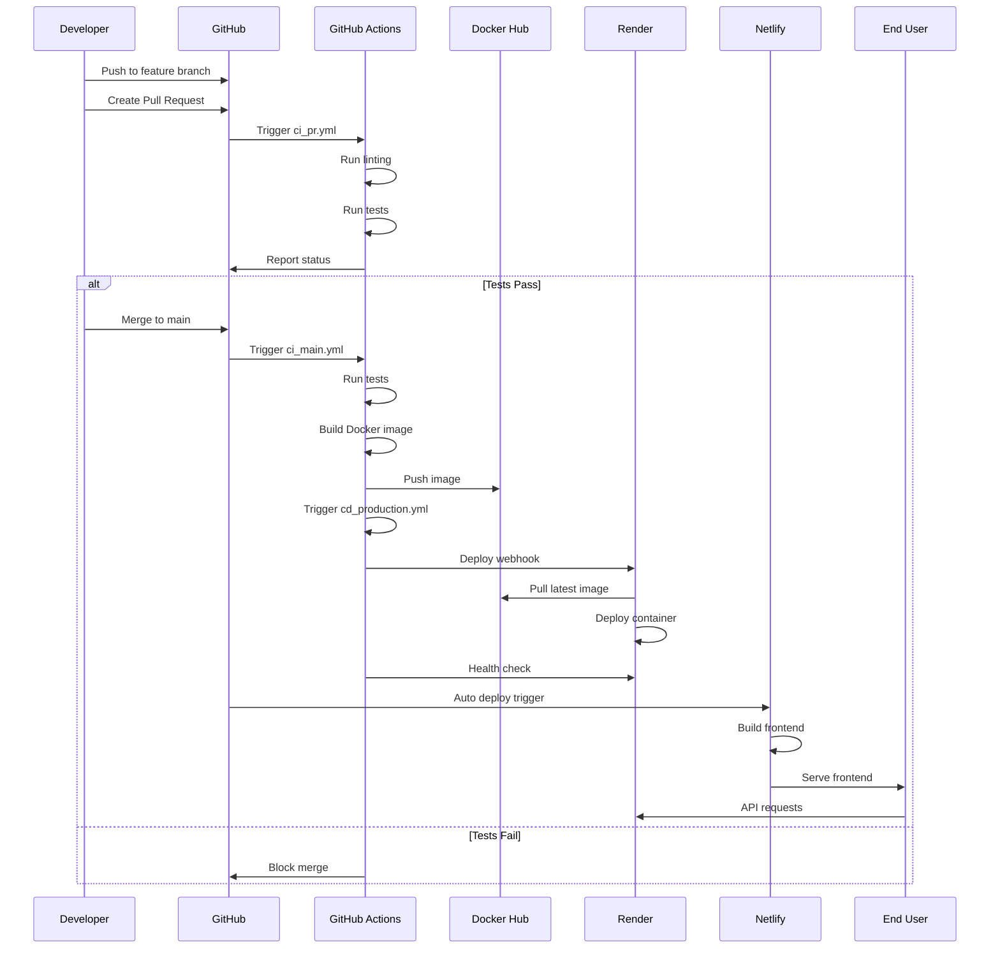
```mermaid
sequenceDiagram
    participant Dev as Developer
    participant GH as GitHub
    participant GHA as GitHub Actions
    participant Hub as Docker Hub
    participant Render as Render
    participant Netlify as Netlify
    participant User as End User

    Dev->>GH: Push to feature branch
    Dev->>GH: Create Pull Request
    GH->>GHA: Trigger ci_pr.yml
    GHA->>GHA: Run linting
    GHA->>GHA: Run tests
    GHA->>GH: Report status

    alt Tests Pass
        Dev->>GH: Merge to main
        GH->>GHA: Trigger ci_main.yml
        GHA->>GHA: Run tests
        GHA->>GHA: Build Docker image
        GHA->>Hub: Push image

        GHA->>GHA: Trigger cd_production.yml
        GHA->>Render: Deploy webhook
        Render->>Hub: Pull latest image
        Render->>Render: Deploy container
        GHA->>Render: Health check

        GH->>Netlify: Auto deploy trigger
        Netlify->>Netlify: Build frontend
        Netlify->>User: Serve frontend
        User->>Render: API requests
    else Tests Fail
        GHA->>GH: Block merge
    end
```

---

## Secrets and Configuration

Secrets are not hardcoded in workflow files. They are injected securely through GitHub Actions Settings (under Secrets and variables).

**Secrets Used:**

- `DATABASE_URI`
- `DOCKERHUB_USERNAME`
- `DOCKERHUB_TOKEN`
- `JWT_SECRET_KEY`
- `OMDB_API_KEY`
- `RENDER_DEPLOY_HOOK_URL`

**Repository Variables:**

- `BACKEND_URL`
- `VITE_API_URL`

---

## Relations and Dependencies

**Service flow:**

Developer → GitHub Repo → GitHub Actions → Docker → Docker Hub → Render → MongoDB Atlas

Key dependencies:

- GitHub Actions requires Docker Hub credentials.
- Render requires Docker Hub image.
- Backend requires `DATABASE_URI` (Atlas).
- Deployment success confirmed via health check.
- (Backend tests depend only on in-memory MongoDB during CI).

### Service Dependencies

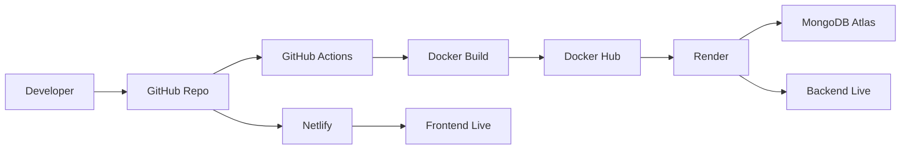
```mermaid
flowchart LR
    Dev[Developer] --> Repo[GitHub Repo]
    Repo --> GHA[GitHub Actions]
    GHA --> Docker[Docker Build]
    Docker --> Hub[Docker Hub]
    Hub --> Render[Render]
    Render --> Atlas[MongoDB Atlas]
    Repo --> Netlify[Netlify]
    Netlify --> Frontend[Frontend Live]
    Render --> Backend[Backend Live]
```

---

## Screenshots

### CI PR Tests & Validation Checks - Workflow

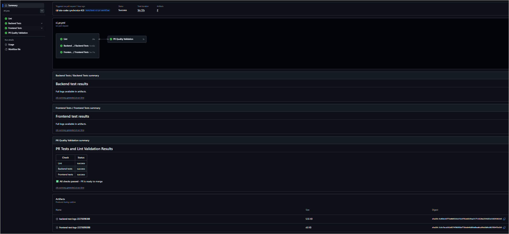

### CI PR Tests - Completed Successfully

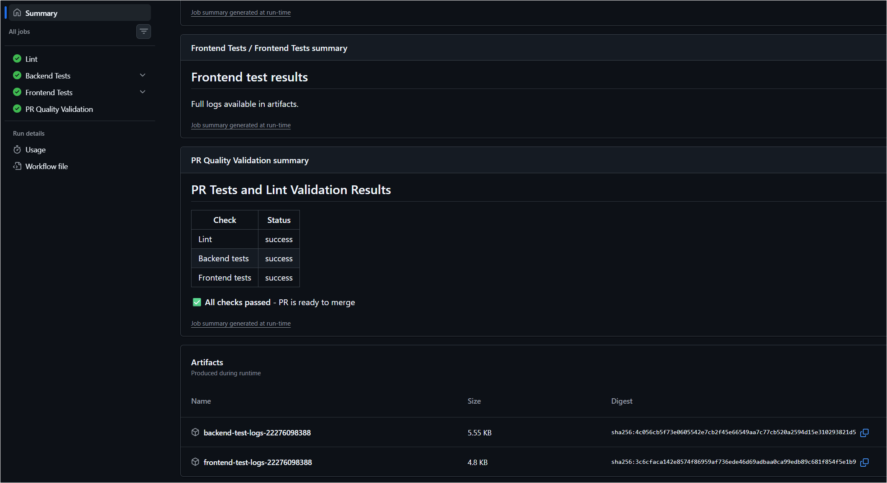

### CI PR Tests - Validation Summary

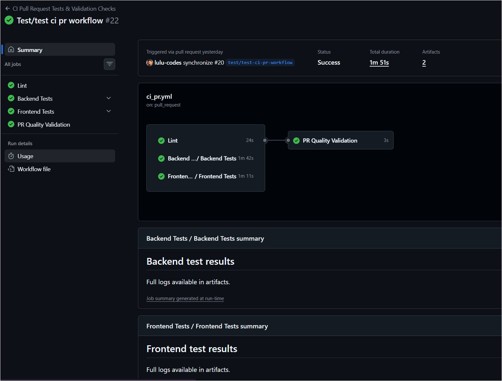

### CI Main Pipeline - Build & Push

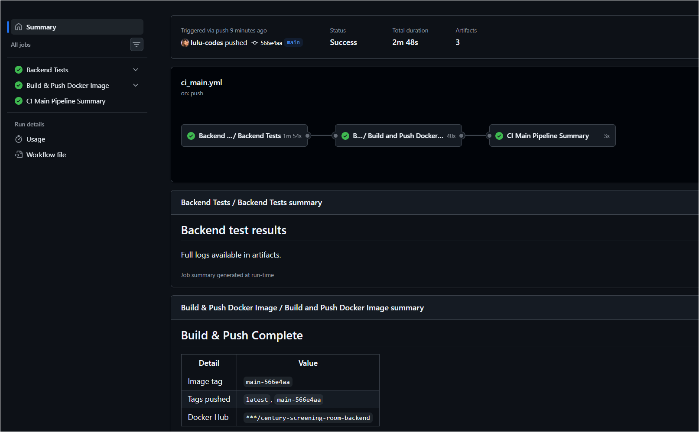

### CI Main Pipeline - Docker Build Summary

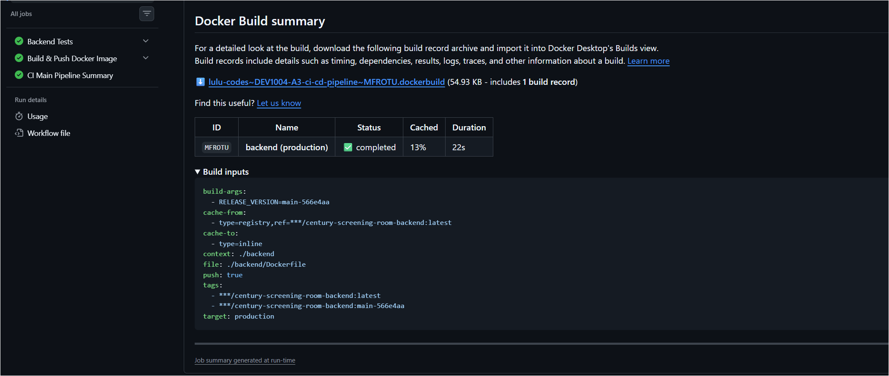

### CI Main Pipeline - Completed with Artifacts

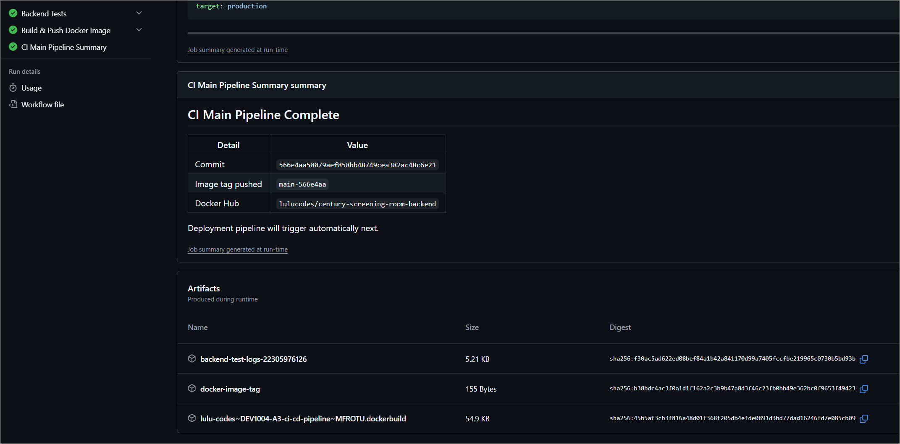

### Build & Push Workflow

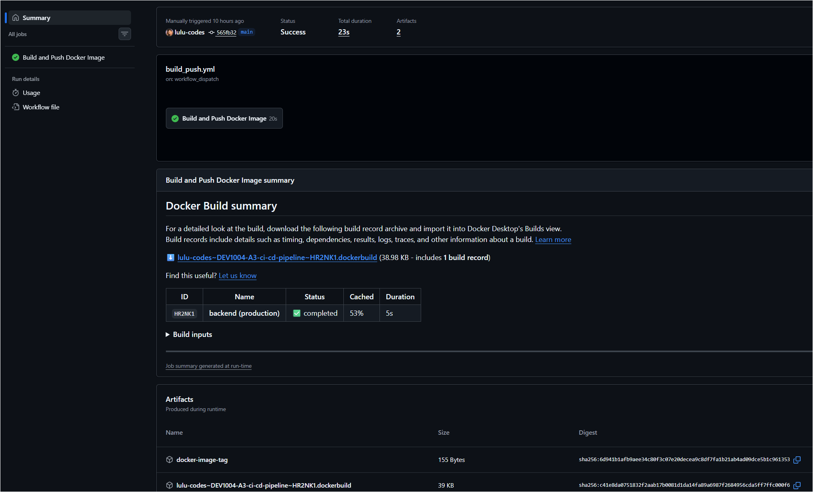

### CD Production Pipeline - Deployed & Completed

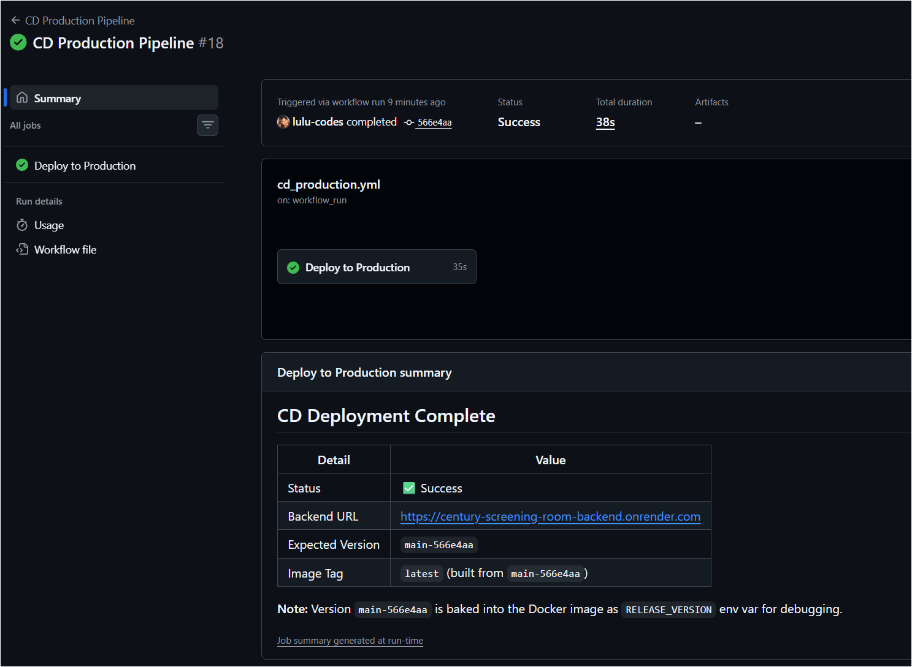

### Backend Tests - Completed

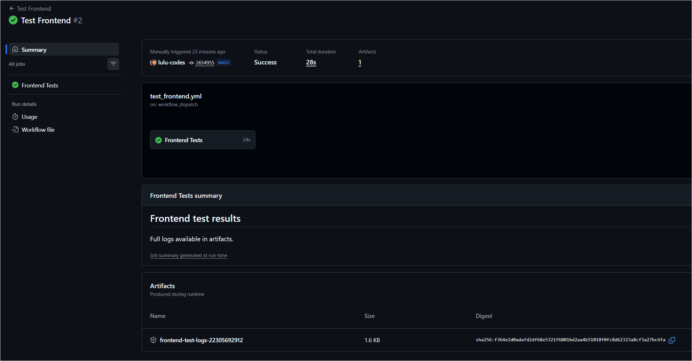

### Frontend Tests - Completed

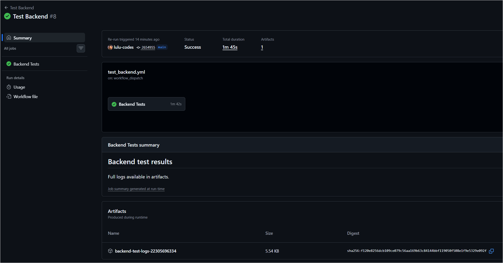

### Docker Hub Registry

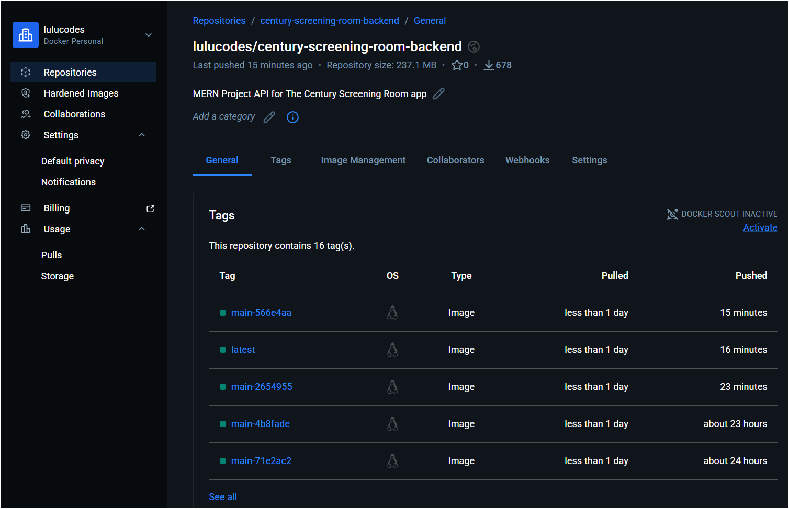

### Netlify Deployment

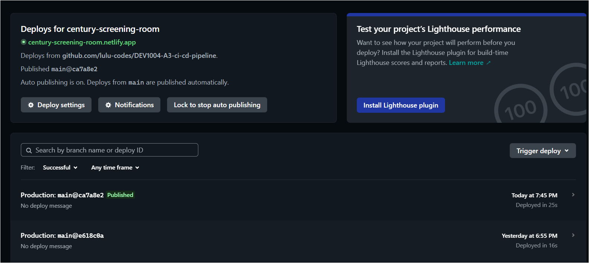

### Render Environment Variables

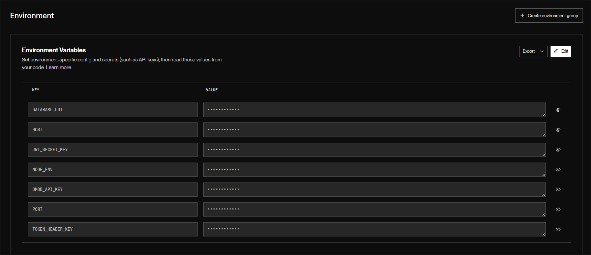

### Render Proof of Deployment

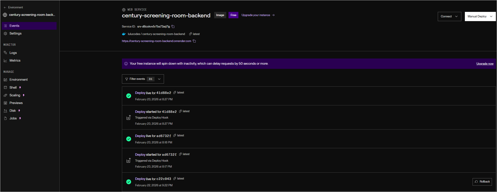

---

### CI - What actually runs on PR

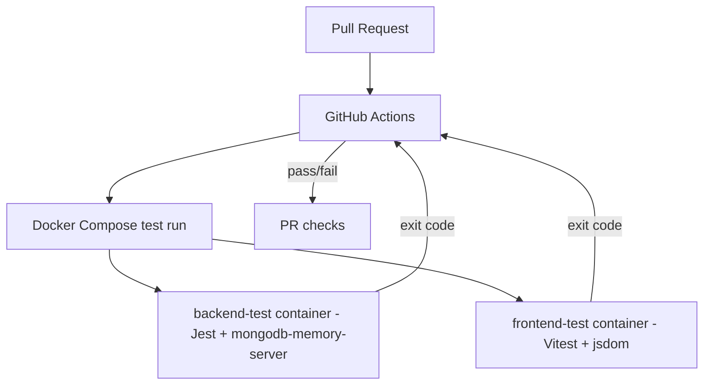
```mermaid
flowchart TB
  PR[Pull Request] --> GHA[GitHub Actions]
  GHA --> DC[Docker Compose test run]

  DC --> BT[backend-test container - Jest + mongodb-memory-server]
  DC --> FT[frontend-test container - Vitest + jsdom]

  BT -->|exit code| GHA
  FT -->|exit code| GHA
  GHA -->|pass/fail| PRstatus[PR checks]
```

### CD - After merge

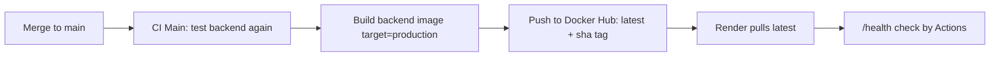
```mermaid
flowchart LR
  M[Merge to main] --> CI[CI Main: test backend again]
  CI --> B[Build backend image target=production]
  B --> Hub[Push to Docker Hub: latest + sha tag]
  Hub --> Render[Render pulls latest]
  Render --> Health[ /health check by Actions]
```

### CI Test Environment

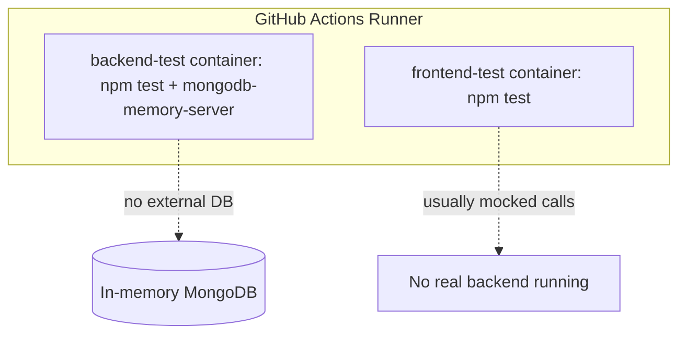
```mermaid
flowchart TB
  subgraph CI[GitHub Actions Runner]
    BT[backend-test container: npm test + mongodb-memory-server]
    FT[frontend-test container: npm test]
  end

  BT -. no external DB .-> MEM[(In-memory MongoDB)]
  FT -. usually mocked calls .-> X[No real backend running]
```
